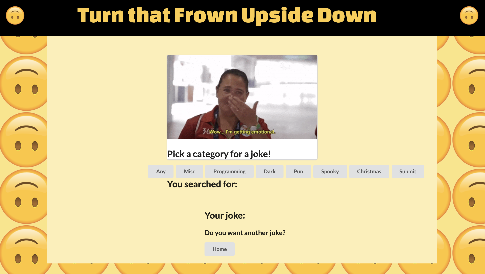

# project-1

 

## Description

This is our first Group Project for the University of Denver Full-Stack Coding Boot Camp!  

For this project, I was to build a weather dashboard that displays current weather data, as well as a 5-day forecast, for cities that the user enters.  

This was a pretty fun project to build. It's the first fully built-from-scratch app I've made that utilizes an API to provide much of the data displayed to the user. More specifically, I used the OpenWeatherMap API to provide the user with current weather data, along with the 5 day forecast. Additionally, the user's previously searched cities are displayed under the search bar, and they can click back to those cities at any point.

## Deployment

The code (and associated assets) are hosted right here in this GitHub repository, and it's all live on the web thanks to GitHub pages. If you would like to check it out, you can view the site at the link below:

<a href="https://lukeoxner.github.io/weather-dashboard" target="_blank"><b>weather-dashboard Live Website</b></a>
  

## Credits

The main languages used in making this project were HTML, CSS, and Javascript. Frameworks / libraries used included jQuery and Semantic UI. APIs utilized were <a href="https://developers.giphy.com/docs/api/" target="_blank"><b>GIPHY API</b></a> and <a href="https://sv443.net/jokeapi/v2/" target="_blank"><b>Jokes API V2</b></a>
